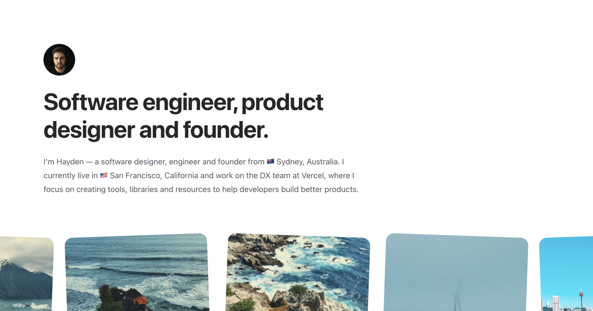

# Daylight

The personal website of [Hayden Bleasel](https://haydenbleasel.com/).



## Colophon

This website is something between a CV and a reflection of my identity — my personal design style. Refined simplicity is my way of achieving mental clarity, so I spent most of my time focused on creating a rich narrative without a word wasted.

I’ve redesigned and rebuilt this website maybe 30 times. Every time I do, I bring in influences from around the internet that add to my personal moodboard of sorts. In turn, everything I change and add makes me more comfortable with the style and in turn, helps me discover myself a little more.

## Design

The design for this iteration is inspired by the layout of [Siddharth Arun](https://sdrn.co/) and [Benji Taylor](https://benjitaylor.info/). Some elements of typography are inspired by [Paco Coursey](https://paco.me/) and some components are inspired by shadcn's [UI Kit](https://ui.shadcn.com/).

The primary typeface is [TWK Lausanne](https://www.weltkern.com/shop/detail-typeface/lausanne) by [Weltkern](https://www.weltkern.com/), a compact and sophisticated sans-serif that reminds me of historical typefaces that I love using in a super-mimimalist way, with (as the author Nizar Kazan noted) an “ultra-organic” aesthetic. It's backed up by [Tiempos Fine](https://klim.co.nz/retail-fonts/tiempos-fine/), a contemporary serif for editorial typography by [Klim Type Foundry](https://klim.co.nz/).

## Technology

It’s built from ground-up with my favourite technologies, starting with Next.js and Vercel for the construct, then Tailwind for utility classes for rapid development.

## Installation

Download the repository and install the dependencies with:

```sh
yarn install
```

Create an `.env.local` file with the following variables:

```sh
NEXT_PUBLIC_SITE_URL="http://localhost:3000" # The URL of the website
COMLINK_PASSPHRASE="" # The passphrase for the Comlink API
POSTMARK_SERVER_API_TOKEN="" # The API token for Postmark
EMAIL_ADDRESS="" # The email address to send emails to
EDGE_CONFIG="" # The configuration for the Vercel Edge Config
```

Then run the local development server with:

```sh
yarn dev
```

## Contributing

If you find any issues or have any suggestions, please feel free to open an issue or pull request.
